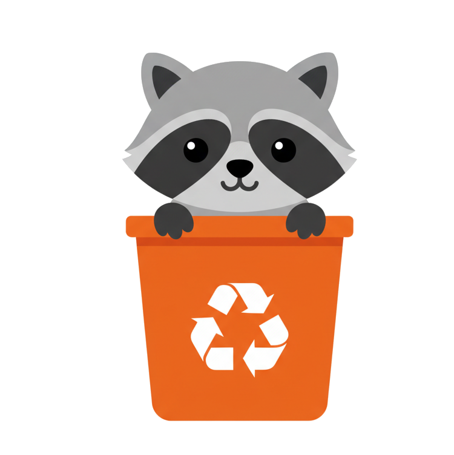

# Trash Optimizer

<p align=center>

</p>

Identify, Navigate, Trash


## Setup

This project uses `pyenv` for Python version management.

### Dev shared environment

For the sake of simplicity let's start with a shared dev environement.
Please note that each components (front, backends) will have there own prod environments moving forward.

```bash
# Install Python version
pyenv install

# Create virtual environment with specific name
pyenv virtualenv 3.12 trash-optimizer

# Activate virtual environment
pyenv activate trash-optimizer

# Install dependencies (if requirements.txt exists)
pip install -r requirements-devshared.txt
```

To automatically activate the environment when entering this directory:
```bash
echo "trash-optimizer" > .python-version
```

## Docker Deployment

For production deployment, use Docker to run both the inference backend and webapp in a single container:

```bash
cd deployment
./setup.sh              # Initial setup
docker-compose up --build  # Build and run
```

See [`deployment/README.md`](deployment/README.md) for complete deployment documentation.
