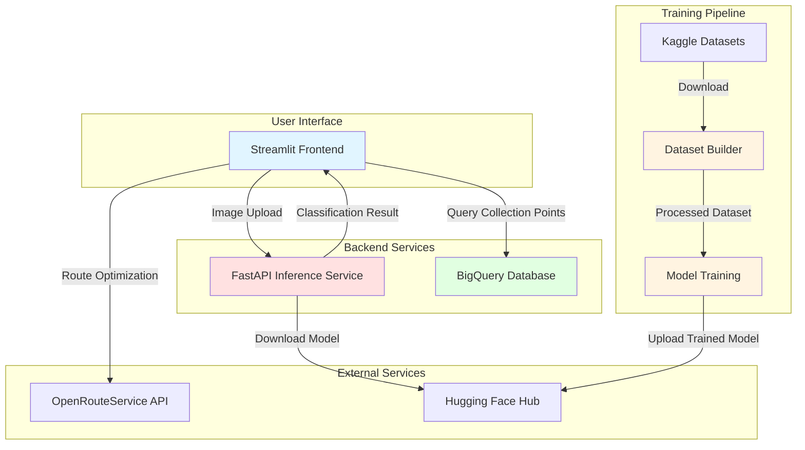

# Trash Optimizer

<p align=center>

</p>

## Context

Trash Optimizer is a 2 week project developed during Le Wagon AI & Data Science Bootcamp (Nantes 2025 November batch) by a team of four students:
- Paul Baudry
- Charles Poisson
- Simon Hingant
- Daria Serbichenko

## Overview

Trash Optimizer addresses two key challenges in waste management: identifying the correct waste category and locating the nearest appropriate disposal facility. This application provides an end-to-end solution for waste classification and route optimization.

### Key Features

- **Image-Based Classification**: Classifies waste items into 18 categories aligned with Nantes Metropole's waste management taxonomy
- **Optimized Route Planning**: Generates the shortest path to relevant collection points based on user location and waste type
- **Geospatial Integration**: Consolidates collection point data from multiple sources into a unified database

### Technical Implementation

**Machine Learning Model**
- Fine-tuned EfficientNetB0 architecture for waste classification
- Trained on 3 labeled datasets comprising 18 waste categories
- Achieves 90% classification accuracy
- Extended from base model's 5 relevant categories to full 18-category taxonomy

**Data Infrastructure**
- Aggregated data from multiple sources: CSV files, Open Data APIs, web scraping, and geoservice APIs
- Consolidated and transformed data pipeline feeding into BigQuery
- Centralized data warehouse serving as single source of truth for collection points

**Route Optimization**
- Batch queries collection points from database based on waste classification
- Calculates inter-point distances using geospatial algorithms
- Generates optimized routes and provides turn-by-turn navigation

### Dataset Sources

**Training Datasets**
- **RealWaste**: [joebeachcapital/realwaste](https://www.kaggle.com/datasets/joebeachcapital/realwaste) - UCI Machine Learning Repository ([DOI](https://archive.ics.uci.edu/dataset/908/realwaste))
- **Recyclable and Household Waste Classification**: [alistairking/recyclable-and-household-waste-classification](https://www.kaggle.com/datasets/alistairking/recyclable-and-household-waste-classification)
- Custom dataset for specialized categories (batteries, light bulbs, electronics, etc.)

**Collection Points Data**
- [Nantes Metropole Waste Management Dataset](https://data.nantesmetropole.fr/explore/dataset/244400404_jeter-dechet-nantes-metropole/table/)

## Quick Start

### Prerequisites
- Python 3.12+
- Docker (for deployment)
- API keys: Hugging Face, OpenRouteService, Google Cloud Platform

### Local Development
```bash
git clone https://github.com/yourusername/trash-optimizer.git
cd trash-optimizer

# Setup individual components (see component READMEs for details)
cd training   # Model training
cd inference  # FastAPI backend
cd webapp     # Streamlit frontend
```

Each component has its own `.env.template` file - copy to `.env` and configure with your API keys.

### Docker Deployment
```bash
cd deployment
./setup.sh
docker-compose up --build
```

See component READMEs for detailed setup instructions.

## Architecture



**Data Flow**:
1. User uploads waste image → Inference API classifies using model from Hugging Face Hub
2. Classification result + user location → Query BigQuery for relevant collection points
3. Collection points → OpenRouteService calculates optimal route → Display to user

## Sub components documentation

- **[Training Module](training/README.md)**: Fine-tune classification models on custom waste datasets
- **[Inference Backend](inference/README.md)**: FastAPI service for waste classification
- **[Webapp Frontend](webapp/README.md)**: Streamlit interface for classification and route optimization
- **[Deployment](deployment/README.md)**: Docker containerization and cloud deployment guides

## Model Repository

Models are hosted on Hugging Face Hub: [https://huggingface.co/cpoisson/trash-optimizer-models](https://huggingface.co/cpoisson/trash-optimizer-models)

## Docker Deployment

For a local or production deployment, use Docker to run both the inference backend and webapp in a single container:

```bash
cd deployment
./setup.sh              # Initial setup
docker-compose up --build  # Build and run
```

See [`deployment/README.md`](deployment/README.md) for complete deployment documentation.

## Known Limitations

- Collection point data is currently specific to Nantes Metropole area
- Model trained primarily on household waste items

## Contributing

This project was developed as an educational bootcamp project at Le Wagon. We welcome feedback, bug reports, and suggestions via issues.

## Acknowledgments

- **Le Wagon** - AI & Data Science Bootcamp (November 2025)
- **Dataset Contributors**: RealWaste (UCI), Kaggle community datasets
- **Nantes Metropole** - Open data initiative for collection points
- **External Services**: Hugging Face Hub, OpenRouteService, Google BigQuery

## License

This project is licensed under the MIT License - see the [LICENSE](LICENSE) file for details.
